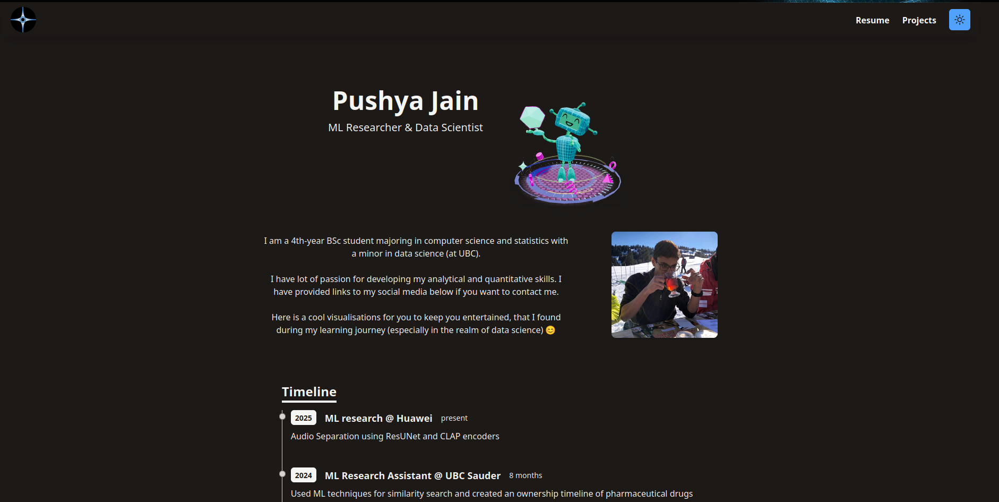
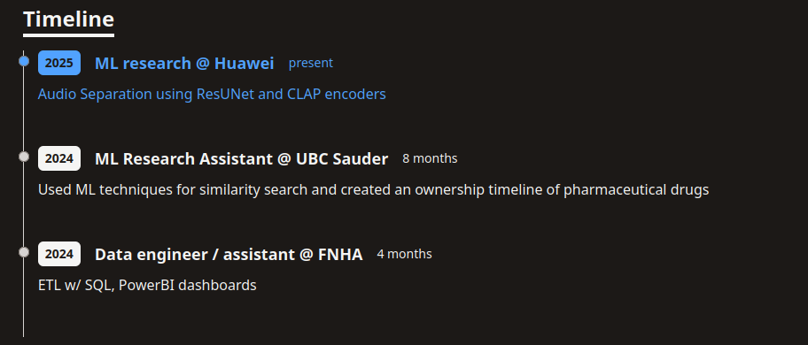
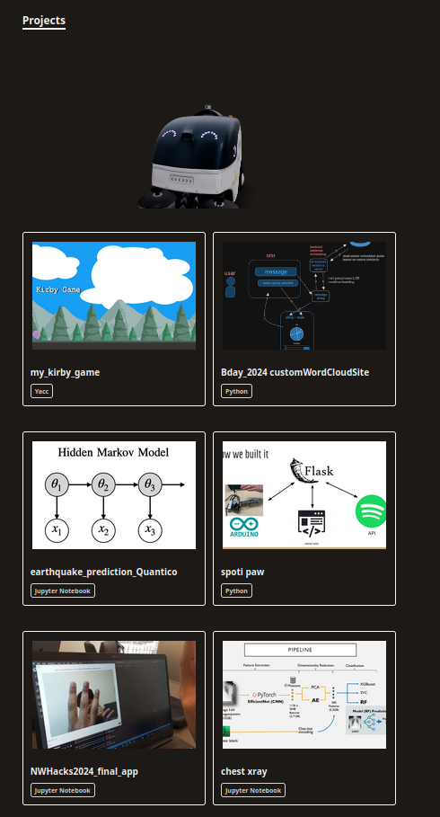

# Motivation 

I was tired of constantly updating my previous website, So the current website updates automatically based on my `GitHub` and `Google Drive` storage.

## Old Idea

The original idea was to use `linkedin`, however, `linkedin` does not allow for normal users access to API for getting certain information. 

## Current Idea

Currently `GitHub` is used to update the following information:
- Timeline:
  - 
    - the blue hovering was due to mouse being present there 
  - This is based on my GitHub's README's profile updates based on specific invisible `regex`. Therefore, I can update my GitHub and my site updates automatically
- Projects:
  - 
    - the robot moves side to side 
  - GitHub does not allow to access pinned comments directly so, I have starred my own projects such that I can access sort the projects by starred values and grab the top $k$ projects 
  - I also use `regex` to grab the first image from the projects' READMEs to serve as profile picture (shown above).

I also use my `Google Drive` to host my pdf Resume which can directly be accessed and shown on my website as shown below:

## Additionally Gimmicks

### Dark mode 
Some other features I wanted and added:
- Ability to switch between dark mode (color palette)and light mode (color palette)
  - Used custom SVG icons that were made with some online and some AI generated code
  - Hovering mechanic where all the hovers over clickable objects and Timeline changes color based on the command palette above

### 3D Objects
- There were certain 3D objects that exudes my personality really well:
  - Little 3D robot that takes some stuff out and I personally thought it was very reminiscent of the old 90s movies of creating AI and doing hacking so I liked it a lot
    - 
    - Available on sketch fab: [Robot playground link](https://sketchfab.com/3d-models/robot-playground-59fc99d8dcb146f3a6c16dbbcc4680da)
  - Little sweeping robot that I animated to move from side to side to show I am cleaning up my projects or cleaning up my website
    - 
    - Available on SketchFab: [Autonomous Robot Sweeper](https://sketchfab.com/3d-models/autonomous-robot-sweeper-0d285c3d015a4573ae1100d298935cb9)
    - This robot is also used to show `error 404` page
  - All of these scenes had a synchornous issue and required the 3D scenes to be loaded asynchronously but I also wanted to convey an object will be present there so I added a temporary placeholder (a black cube) which is then replaced by the loaded 3D objects 

Since the site required dynamic loading and such, the GitHub pages could not load the static sites, I had to switch from `GitHub pages` $\to$ `Vercel`

### Multiple API fetches

Technically the website fetches the data each time the site is loaded, however, I did not want someone to accidentally max out the GitHub API's (even though it is 60/hrs), I also load the projects and timeline in the browser's cache and store it there. 
- This could still be maxxed out if someone deletes the broswer's cache and then reloads the website each time but then this person is actively trying to stress test my website which is not as impressive as it sounds. 
